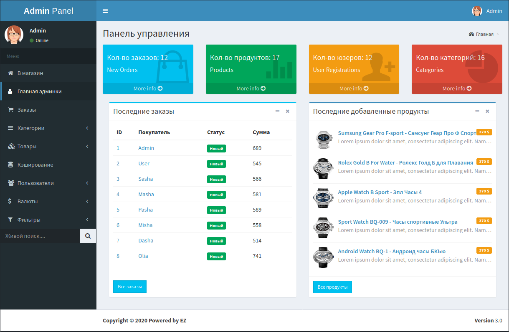

# Laravel Shop Admin Panel


The project was created on the basis of the course "Laravel - creating an admin panel."

Course author: Alexander Batashov.

### Requirements
The requirements to application is:
*    **PHP - Supported Versions**: >= 7
*    **Webserver**: Nginx or Apache
*    **Database**: MySQL, or Maria DB
### Installation
#### 1. Git Clone
```sh
$ git clone https://github.com/evgeniizab/laravel.shop.admin.git
$ cd laravel.shop.admin
$ composer install
```
#### 2. Database
.env file

```sh
DB_CONNECTION=mysql
DB_HOST=XXXX
DB_PORT=3306
DB_DATABASE=XXXX
DB_USERNAME=XXXX
DB_PASSWORD=XXXX
```
Remember: Create the database before run artisan command.

```sh
$ php artisan migrate --seed
```
Generate your application encryption key: 
```sh
$ php artisan key:generate
```
#### 3. Open the application in a browser



